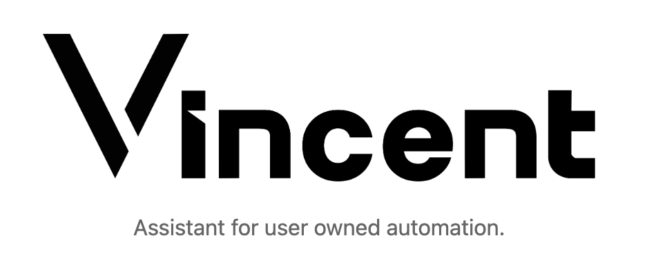
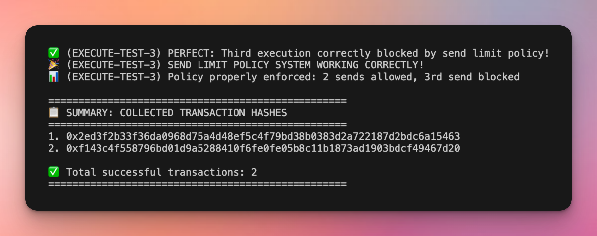
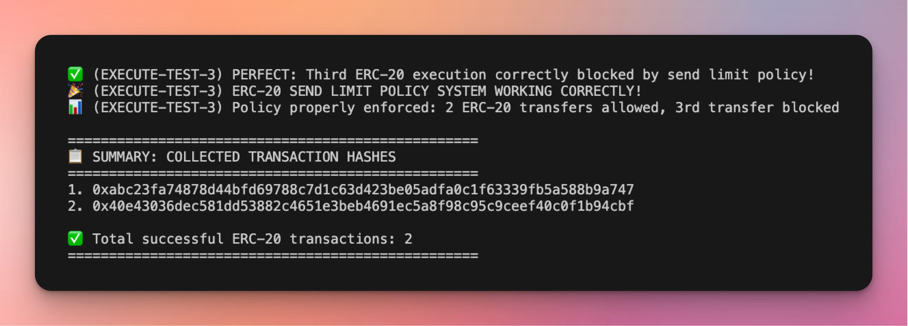

# Deprecation Notice

> [](https://github.com/LIT-Protocol/vincent-starter-kit)
>
> **This Vincent Starter Template has been deprecated**  
> Please checkout the new [Vincent Starter Kit](https://github.com/LIT-Protocol/vincent-starter-kit) for the latest guide on how to get started developing for Vincent.
>
> No further development will happen here, and this repo is no longer being maintained

---

# Vincent Tool Policy Starter Template



A starter template or playground for creating **Vincent Tools** and **Vincent Policies** that execute on Lit Actions - immutable JavaScript programs that run on a decentralized Lit Protocol network.

📺 **[Vincent Tutorial Video](https://www.youtube.com/watch?v=Hkzu8np9Ta8)** - Watch this quick video walkthrough to get started with building tools and policies in Vincent

# Prerequisites

- **ETH Private key**

  Used to fund all other private keys in tests

  - Minimum requirement: 0.13 LIT tokens
  - Get LIT Test tokens: [Chronicle Yellowstone Faucet](https://chronicle-yellowstone-faucet.getlit.dev/)

- **Pinata JWT Key**

  Required to pin tools and policies to IPFS

  - Get API key: [Pinata Developers](https://app.pinata.cloud/developers/api-keys)

## ⚠️ (experiment) Very Quick Start

```bash
npx @lit-protocol/vincent-scaffold-sdk
```

## Quick Start

1. Clone this repo

2. **Set up environment variables**

   Create a `.env` file with the following variables:

   - `TEST_FUNDER_PRIVATE_KEY`
   - `PINATA_JWT`

3. **Install dependencies**

   ```bash
   npm install
   ```

4. **Build tools and policies**

   ```bash
   npm run vincent:build
   ```

5. **Run default E2E tests**

   ```bash
   npm run vincent:e2e
   ```

   

   > **Tools tested**: [native-send](./vincent-packages/tools/native-send/README.md) | **Policy**: [send-counter-limit](./vincent-packages/policies/send-counter-limit/README.md)

   ```bash
   npm run vincent:e2e:erc20
   ```

   

   > **Tools tested**: [erc20-transfer](./vincent-packages/tools/erc20-transfer/README.md) | **Policy**: [send-counter-limit](./vincent-packages/policies/send-counter-limit/README.md)

## Development Workflow

### Making Changes

When you modify tools or policies, you must rebuild them before running E2E tests again. The build process regenerates the Lit Action code and updates IPFS references.

> ❗️ The E2E tests are isolated per test file and automatically register new app versions, so you can typically just build and test. However, you **may** need to manually reset the E2E test state if something doesn't work as expected.

```bash
# Rebuild after changes
npm run vincent:build

# Reset E2E test state
npm run vincent:e2e:reset

# Complete reset (removes node_modules, dist directories, package-lock files)
npm run vincent:hardreset
```

### Testing New Tools

To test a new tool:

1. Copy the existing `vincent-e2e/src/e2e.ts` file
2. Rename it to your desired name (e.g., `e2e-my-tool.ts`)
3. Update the imports and tool configurations
4. Add a new script to `package.json` for easy testing

Example:

```json
{
  "scripts": {
    "vincent:e2e:my-tool": "dotenv -e .env -- tsx vincent-e2e/src/e2e-my-tool.ts"
  }
}
```

To reduce noise in test output, you can suppress debug logs from the dependent SDK by setting the suppression flag to `true`:

```ts
import { suppressLitLogs } from "@lit-protocol/vincent-scaffold-sdk/e2e";

// Apply log suppression FIRST, before any imports that might trigger logs
suppressLitLogs(true);
```

## Creating New Tools & Policies

### 🧪 (experiment) AI-Assisted Development

To "one shot prompt" a create a new tool or policy, ask AI to reference the [ERC-20 Feature Request](./erc-20-feature-request.md) as a base prompt for your specific feature requirements.

> ⚠️ This is not guaranteed. It will get you 90% of the way there, but you might need to fix some bugs in the tool or policy.

### Manual Copy & Paste Approach

Alternatively, you can simply copy and paste an existing tool or policy and modify the configurations:

```bash
# Copy an existing tool
cp -r vincent-packages/tools/native-send vincent-packages/tools/my-new-tool

# Copy an existing policy
cp -r vincent-packages/policies/send-counter-limit vincent-packages/policies/my-new-policy
```

Then update the package names, descriptions, and configurations in the copied directories.

### CLI approach ("might" get deprecated)

Use the Vincent Scaffold SDK CLI:

```bash
# Add a new tool
npx @lit-protocol/vincent-scaffold-sdk add tool <path>/<name>

# Add a new policy
npx @lit-protocol/vincent-scaffold-sdk add policy <path>/<name>
```

## Architecture

- **Tools** - Executable Lit Actions
- **Policies** - Governance rules that control tool execution
- **Lit Actions** - Secure execution environment with strict Node.js constraints
- **E2E Testing** - Integrated testing with blockchain simulation

## Key Constraints

- ❌ No `globalThis`, `process.env`, or Node.js built-ins in tools/policies
- ❌ No persistent memory between executions
- ❌ No file system access during execution
- ✅ Use Zod schemas for type safety
- ✅ Use `laUtils` API only in designated execution phases

## Available Commands

```bash
npm run vincent:build              # Build all tools and policies
npm run vincent:e2e               # Run native transfer E2E tests
npm run vincent:e2e:erc20         # Run ERC-20 transfer E2E tests
npm run vincent:e2e:reset         # Reset E2E test state only
npm run vincent:hardreset         # Reset all state and rebuild
```

## Documentation

- [AI Development Guidelines](./AGENTS.md) - Essential guidance for AI agents
- [Claude Code Guidelines](./CLAUDE.md) - Project-specific development patterns
- [ERC-20 Implementation Example](./erc-20-feature-request.md) - Reference for new tool development
- [Official Vincent Documentation](https://docs.heyvincent.ai/) - Complete Vincent framework documentation

```

```
